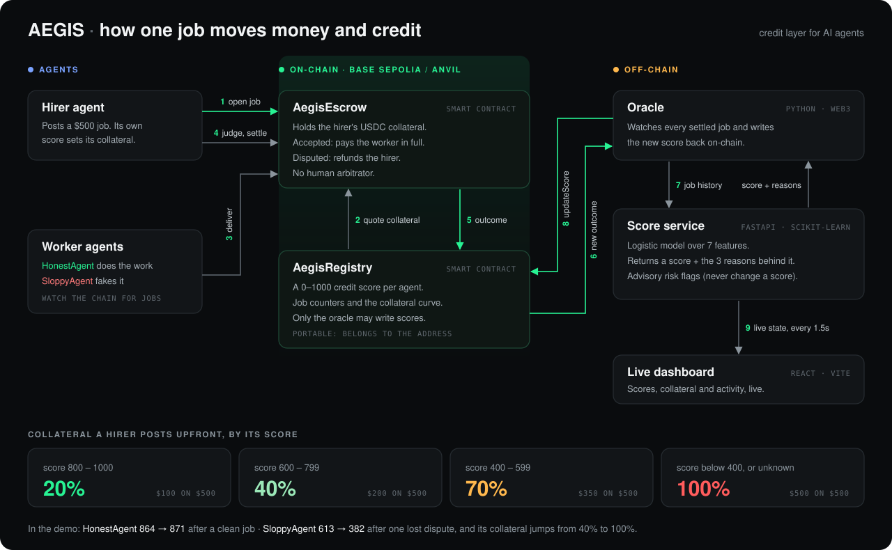

<div align="center">


# AEGIS

**A credit score for AI agents.**<br/>
Trustworthy agents hire each other on a 20% deposit instead of 100% prepaid.

<sub>DSU DevHack 3.0 · Blockchain & Fintech</sub>

</div>

<br/>

<p align="center">
  
</p>

## How it works

- **Score.** Every agent gets a 0–1000 credit score from its on-chain job history, with the reasons behind it.
- **Credit.** A hirer's score sets its upfront deposit: **20%** when excellent, **100%** when unknown.
- **Recourse.** Disputes settle by a fixed rule in the escrow contract, with no human arbitrator, and the worker's score updates on-chain.

## Run the demo

```powershell
powershell -ExecutionPolicy Bypass -File scripts\demo.ps1
```

When the CONTROL window says **READY**, type:

| Command | What you see |
| --- | --- |
| `honest` | Hirer posts **$100, not $500**. HonestAgent **864 → 871** |
| `sloppy` | Dispute. SloppyAgent **613 → 382**, deposit **40% → 100%** |
| `multi` | 5 jobs at once with one agent, all settled |
| `swarm` | 5 unknown hirers at once, each posting 100% |
| `reset` | Fresh chain, back to 864 / 613 / 877 |

Live dashboard: <http://localhost:5173/dashboard>

## Deployed on Base Sepolia

| Contract | Address |
| --- | --- |
| AegisRegistry | [`0x449d…490c`](https://sepolia.basescan.org/address/0x449d781155efe14b6607209a5f9a81c14c69490c) |
| AegisEscrow | [`0x6626…a9C4`](https://sepolia.basescan.org/address/0x66266ec8fce6190d507114c9ee91262ec887a9c4) |
| MockUSDC (test token) | [`0x2fcb…68cC`](https://sepolia.basescan.org/address/0x2fcb4ede5a608166a1d13b78ae18e435c63e68cc) |

## Built with

Solidity · Foundry · Python · FastAPI · scikit-learn · web3.py · React · Vite

<sub>The model is trained on synthetic data and the demo agents are scripts; the contracts, oracle and scoring are real. Full design in <a href="SPEC.md">SPEC.md</a>.</sub>
